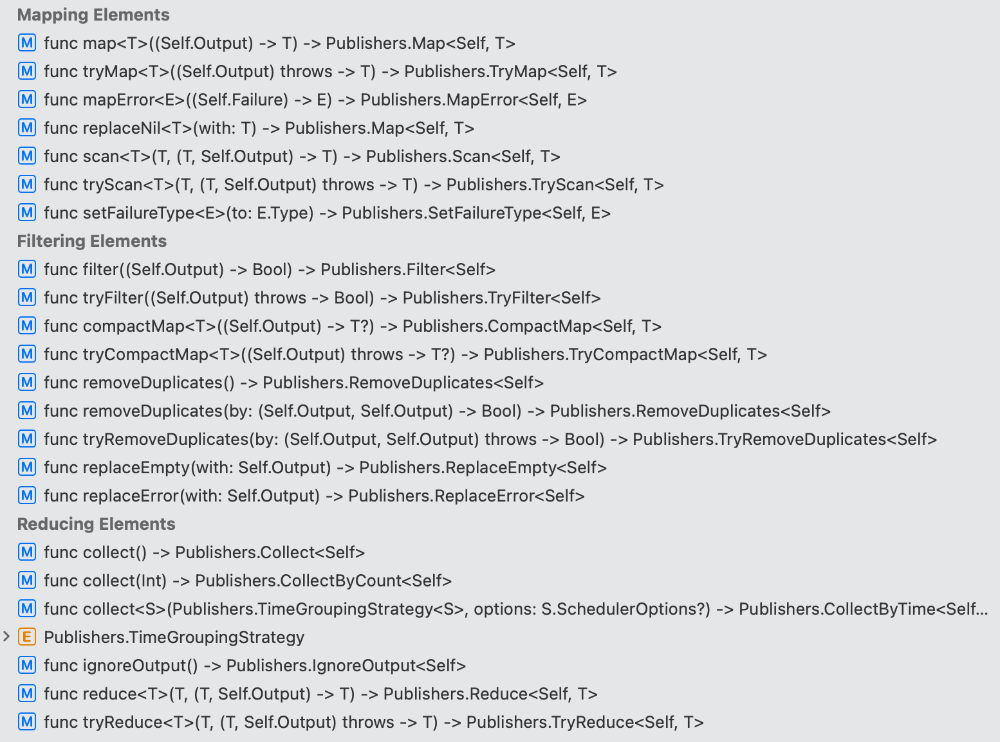

[edit](https://github.com/CSCIX65G/FreeCombine/edit/gh-pages/README.md)

# FreeCombine

## TL;DR

FreeCombine is a streaming library designed to implement every Publisher operator in Apple's Combine framework only in `async` context.  This does NOT mean that _all_ semantics or syntax stays the same.  Implementing a streaming library like this in a concurrent fashion means that some things must change to prevent races and leaks.

Here's a silly example of Combine that you can cut and paste into any playground:
```swift
import Combine
func combineVersion() {
    let subject1 = Combine.PassthroughSubject<Int, Error>()
    let subject2 = Combine.PassthroughSubject<String, Error>()
    
    let seq1 = "abcdefghijklmnopqrstuvwxyz".publisher
    let seq2 = (1 ... 100).publisher
    
    let z1 = seq1.zip(seq2)
        .map { left, right in String(left) + String(right) }
    let m1 = subject1
        .map(String.init)
        .mapError { _ in fatalError() }
        .merge(with: subject2)
        .replaceError(with: "")
    
    let m2 = z1.merge(with: m1)
    let cancellable = m2.sink { value in
        print("Combine received: \(value)")
    }
    
    subject1.send(14)
    subject2.send("hello, combined world!")
    subject1.send(completion: .finished)
    subject2.send(completion: .finished)
    cancellable.cancel()
}
combineVersion()
```
This produces the following.  Note that `14` and `hello, combined world!` always appear at the end:
```
Combine received: a1
Combine received: b2
Combine received: c3
Combine received: d4
Combine received: e5
Combine received: f6
Combine received: g7
Combine received: h8
Combine received: i9
Combine received: j10
Combine received: k11
Combine received: l12
Combine received: m13
Combine received: n14
Combine received: o15
Combine received: p16
Combine received: q17
Combine received: r18
Combine received: s19
Combine received: t20
Combine received: u21
Combine received: v22
Combine received: w23
Combine received: x24
Combine received: y25
Combine received: z26
Combine received: 14
Combine received: hello, combined world!
```
Here's the same example using FreeCombine which can be cut and pasted into a Playground which has access to FreeCombine:
```swift
import FreeCombine
import _Concurrency
func freeCombineVersion() {
    Task {
        let subject1 = try await FreeCombine.PassthroughSubject(Int.self)
        let subject2 = try await FreeCombine.PassthroughSubject(String.self)
        
        let seq1 = "abcdefghijklmnopqrstuvwxyz".asyncPublisher
        let seq2 = (1 ... 100).asyncPublisher
        
        let z1 = seq1.zip(seq2)
            .map { left, right in String(left) + String(right) }
        let m1 = subject1.publisher()
            .map(String.init)
            .mapError { _ in fatalError() }
            .merge(with: subject2.publisher())
            .replaceError(with: "")
        
        
        let m2 = z1.merge(with: m1)
        let cancellable = await m2.sink { value in
            guard case let .value(value) = value else { return .more }
            print("FreeCombine received: \(value)")
            return .more
        }
        
        try await subject1.send(14)
        try await subject2.send("hello, combined world!")
        try await subject1.finish()
        try await subject2.finish()
        _ = await cancellable.result
    }
}
freeCombineVersion()
```
This produces the following. Observe how the zip does not block at all and value Int(14) and String("hello, combined world!") are emitted asynchronously as they occur.
```
FreeCombine received: a1
FreeCombine received: b2
FreeCombine received: 14
FreeCombine received: c3
FreeCombine received: d4
FreeCombine received: e5
FreeCombine received: hello, combined world!
FreeCombine received: f6
FreeCombine received: g7
FreeCombine received: h8
FreeCombine received: i9
FreeCombine received: j10
FreeCombine received: k11
FreeCombine received: l12
FreeCombine received: m13
FreeCombine received: n14
FreeCombine received: o15
FreeCombine received: p16
FreeCombine received: q17
FreeCombine received: r18
FreeCombine received: s19
FreeCombine received: t20
FreeCombine received: u21
FreeCombine received: v22
FreeCombine received: w23
FreeCombine received: x24
FreeCombine received: y25
FreeCombine received: z26
```

## Like Combine. Only free. And concurrent.

FreeCombine is a functional streaming library for the Swift language.  

Functional streaming comes in two forms: push and pull.  FreeCombine is pull.  RxSwift and ReactiveSwift are push.  Combine is both, but primarily pull. (If you have ever wondered what a Subscription is in Combine, it's the implementation of pull semantics). AsyncSequence in Apple's Swift standard library is pull-only.  While there are exceptions, streams in synchronous systems tend to be push, in asynchronous systems they tend to be pull. Different applications are better suited to one form of streaming than the other. The main differences lie in how the two treat combinators like zip or decombinators like Combine's Subject. 

All streaming libraries are written in the Continuation Passing Style (CPS).  Because of this they share certain operations for the Continuation type: map, flatMap, filter, reduce, et al.  

Promise/Future systems are also written in CPS and as a result share many of the same operations.  FreeCombine incorporates NIO-style Promises and Futures as a result.

FreeCombine differs from AsyncSequence (and its support in Apple's swift-async-algorithms package) in the following key ways.  FreeCombine is:

* Protocol-free.
  * No protocols, only concrete types
  * Eager type erasure
  * Explicit implemenation of the continuation-passing style via Continuation type.
* Race-free.
  * Yield-free.
  * Sleep-free.
  * subscribeOn-race-free.  (Continuations are only created after upstream continuations are guaranteed to exist)
* Leak-free.
  * ARC-like Task lifetimes
  * ARC-like Continuation lifetimes
* Lock-free.
  * Queueing channel instead of locking channel
  * Blocking, not locking
  * No use of `os_unfair_lock` or equivalent constructs in other operating system 

These "freedoms" imply the following specific restrictions:

Don'ts:
* No use of `protocol`
* No use of `TaskGroup` or `async let`
* No use of `AsyncSequence`
* No use of `swift-async-algorithms`

Sort of Don'ts:
* Use of `for await` only in StateTask
* Use of `Task.init` only in Cancellable
* Use of `[Checked|Unsafe]Continuation` only in Resumption
* Use of `AsyncStream.init` only in Channel
* Use of .unbounded as BufferingPolicy only in Channel's which accept subscribe operations

## Salient features

1. "Small things that compose"
1. Implement all operations supported by Combine, but some require modification
1. Uses "imprecise" errors throughout in the manner of Swift NIO.
1. Tasks and Continuations can _always_ fail due to cancellation so no Failure type on Continuations
1. Principled handling of cancellation throughout 
1. Futures _AND_ Streams, chocolate _AND_ peanut butter
1. No dependency on Foundation
1. Finally and very importantly, ownership of Tasks/Cancellables can be transferred or even shared.


## Introduction

  For a long time I've been exploring the idea of what Apple's Swift Combine framework would look like if written without using protocols. The advent of Concurrency support in Swift 5.5 provided an impetus to complete that exploration. This repository represents the current state of that effort and consists of material that I intend to incorporate into classes I teach on iOS development at [Harvard](https://courses.dce.harvard.edu/?details&srcdb=202203&crn=33540) and at [Tufts](https://www.cs.tufts.edu/t/courses/description/fall2021/CS/151-02).

  Ideally, this material would become the core of an expanded course on Functional Concurrent Programming using Swift, but that course is still fairly far off.  
  
  Secondarily, this repo is my own feeble attempt to answer the following questions: 
  
  1. Why does Swift's Structured Concurrency, not have the same set of primitives as (say) Concurrent Haskell?
  1. Why is that whenever I ask someone: do you use TaskGroup or `async let`, they respond, "I don't but I'm sure that there are other people who do." ?
  1. Why is it that Task lifetimes much align with their parent's lifetime, but that other objects which are in a parent-child relationship have no such restriction?
  1. Are there differences between what we mean when we refer to Structured Concurrency and what we mean when we refer to Functional Concurrency and precisely what would those differences be?

  ### Functional Requirements

  In November of 2021 [Phillipe Hausler observed](https://forums.swift.org/t/should-asyncsequence-replace-combine-in-the-future-or-should-they-coexist/53370/10) that there were several things that needed to be done to bring Combine functionality into the new world of Swift Concurrency. The list provided there was added to the requirements and the following are currently in the library:

  1. Combinators
  2. Distributors (which I have termed Decombinators)
  3. Temporal Transformation
  4. Failure Transformation
  5. Getting the first result from N running tasks

  ## Design Philosophy

  I've taught Combine several times now and invariably 3 questions come up:

  1. Why does every function on a Publisher return a different type?
  1. Why does chaining of Publisher functions produce incomprehensible types?
  1. Why do the required functions for a Publisher and Subscriber all say `receive`?

  I believe that these are reasonable questions and this project attempts to deal with all three.

  Additionally, there are similar questions with EventLoopFuture and EventLoopPromise in NIO.

  1. Why is Future a class and not a struct?
  1. Why can't NIO just use Concurrency like other Swift libraries?
  1. Are there other use cases that I should be worrying about where I can't use Concurrency?

  ### On Deprotocolization

The answer to question 1 on why every function returns a different type essentially comes down to the use of having Publisher be an existential type (aka a protocol) rather than a plain generic type. Here's an example of what I'm talking about:



Here's a challenge I give my students. The map functions on Array and Optional look like this:

```
 (Array<A>) ->    (_ f: (A) -> B) -> Array<B>
 (Optional<A>) -> (_ f: (A) -> B) -> Optional<B>
```

It looks as if we should be able to write a protocol `Mappable` which would accomodate both cases and which Array and Optional could conform to. Turns out that you can't for reasons that are explained deeply by Elviro Rocca [here](https://broomburgo.github.io/fun-ios/post/why-monads/). The heading: `Can we go higher?` about 2/3 of the way down discusses why you can't write that protocol.

If we insist on the use of protocols for Combine, the only real alternative is to provide a concrete generic type as the return type for every function. This is precisely the problem that Joe Groff describes in his famous [April 2019 post on opaque return types](https://forums.swift.org/t/improving-the-ui-of-generics/22814#heading--limits-of-existentials).

Following onto the ideas in those posts, [Holly Borla in SE-335](https://github.com/apple/swift-evolution/blob/main/proposals/0335-existential-any.md#introduction) makes a very compelling case for why we avoid should protocols in libraries like Combine. Here's the money quote:

```
Existential types in Swift have an extremely lightweight spelling: a plain protocol name in type context means an existential type. Over the years, this has risen to the level of active harm by causing confusion, leading programmers down the wrong path that often requires them to re-write code once they hit a fundamental limitation of value-level abstraction.
```

In my opinion, what SE-335 is saying applies to Combine (and frankly to AsyncSequence in the standard library). The question is: how do we _NOT_ use existentials in a library like Combine. And the answer is to use generics instead. In the next playground we derive a generic-only version of Combine from the required Combine protocols 

### Flow of Control

1. Subscription provides 1 demand
1. Additional values are only sent when previous call returns .more
1. An infinite number of values can be sent
1. Completion can occur in the following ways:
    * Returning .done means that no more values will be sent (reactive completion).
    * Throwing an error means that no more values will be sent
    * Sending .completion(.finished|.cancelled|.failure(Error)) means that the value returned is ignored (proactive)
    * External cancellation causes .completion(.cancelled) to be sent as the next demanded value (external)

## Todo

1. ~~Implement leak prevention on UnsafeContinuation, Task, and AsyncStream.Continuation~~
1. ~~maybe add an additional repo (FreeCombineDispatch) that depends on libdispatch to get delay, debounce, throttle~~
1. revamp StateThread to be exactly a concurrency aware version of TCA's store
1. Add support for Promise/Future
1. Add a repo which implements asyncPublishers for everything in Foundation that currently has a `publisher`
1. ~~fully implement all Combine operators~~
1. Add a Buffer publisher/operator to reintroduce a push model via an independent source of demand upstream
1. Get to 100% test coverage
1. Document this at the level of writing a book in the form of playgrounds
